# 🚀 AWS-HA-WebApp

A production-grade, highly available web application built on AWS using EC2 Auto Scaling, Application Load Balancer, RDS MySQL, and a custom VPC — deployed across 2 Availability Zones.


---

## 🏗️ Architecture Overview

```
Internet
    │
    ▼
Application Load Balancer (HA-WebApp-ALB)
    │                    │
    ▼                    ▼
EC2 (us-east-1a)    EC2 (us-east-1b)   ← Auto Scaling Group (min:2, max:4)
    │                    │
    └──────────┬──────────┘
               ▼
       RDS MySQL (ha-webapp-db)
         [Private Subnet]
```

---

## 🛠️ How I Built This

**Step 1 — VPC & Networking**
Created a custom VPC `My-Web` (10.0.0.0/16) with 4 subnets across 2 Availability Zones — 2 public (10.0.1.0/24, 10.0.2.0/24) and 2 private (10.0.3.0/24, 10.0.4.0/24). Attached an Internet Gateway and created a Public Route Table with a 0.0.0.0/0 route to the IGW, then associated both public subnets to it.

**Step 2 — Security Groups**
Created 3 security groups with layered rules:
- `ALB-SG` → allows HTTP port 80 from internet
- `EC2-WebServer-SG` → allows port 80 only from ALB-SG
- `RDS-SG` → allows MySQL port 3306 only from EC2-WebServer-SG

**Step 3 — Launch Template**
Created `HA-WebApp-LT` using Amazon Linux 2 AMI (t3.micro) with a user data script that installs Apache and serves a simple HTML page showing the Instance ID and Availability Zone.

**Step 4 — Auto Scaling Group**
Created `HA-WebApp-ASG` using the Launch Template with desired capacity 2, minimum 2, maximum 4 — spanning both public subnets across 2 AZs.

**Step 5 — Load Balancer**
Created an internet-facing Application Load Balancer `HA-WebApp-ALB` across both public subnets. Created Target Group `HA-WebApp-TG` (HTTP:80) and registered the ASG instances. Both targets showed **Healthy** status.

**Step 6 — RDS Database**
Created a DB Subnet Group using the 2 private subnets. Launched `ha-webapp-db` (MySQL, db.t3.micro) in the private subnets — no internet access, only accessible from EC2 instances via RDS-SG.

**Step 7 — Monitoring & Alerts**
Created CloudWatch Alarm `HA-WebApp-HighCPU` to trigger when CPU > 70% for 1 datapoint in 5 minutes. Created SNS Topic `ScalingAlerts` and confirmed email subscription to receive scaling notifications.

**Step 8 — Verified**
Accessed the live web app via the ALB DNS URL — Status showed ✅ Running.

---

## ☁️ AWS Services Used

| Service | Resource Name | Purpose |
|---|---|---|
| VPC | My-Web (10.0.0.0/16) | Isolated private network |
| Subnets | Public Sub-1/2, Private Sub-1/2 | 2 AZs, public + private |
| Internet Gateway | My IGW | Internet access for public subnets |
| Route Table | Public RT | Routes traffic to IGW |
| Security Groups | ALB-SG, EC2-WebServer-SG, RDS-SG | Layered security |
| EC2 Launch Template | HA-WebApp-LT (t3.micro) | EC2 auto-config template |
| Auto Scaling Group | HA-WebApp-ASG | Min 2, Max 4 instances |
| Application Load Balancer | HA-WebApp-ALB | Distributes traffic across AZs |
| Target Group | HA-WebApp-TG | Health checks on port 80 |
| RDS MySQL | ha-webapp-db (db.t3.micro) | Private database |
| DB Subnet Group | ha-webapp-db-subnet-group | RDS across 2 private subnets |
| CloudWatch Alarm | HA-WebApp-HighCPU | Triggers when CPU > 70% |
| SNS Topic | ScalingAlerts | Email alerts on scaling events |

---

## 🔒 Security Architecture

- **ALB-SG** — Allows HTTP port 80 from the internet (0.0.0.0/0)
- **EC2-WebServer-SG** — Allows port 80 only from ALB-SG (not public)
- **RDS-SG** — Allows MySQL port 3306 only from EC2-WebServer-SG

---

## 📸 Screenshots

### 1. VPC Created — My-Web (10.0.0.0/16)
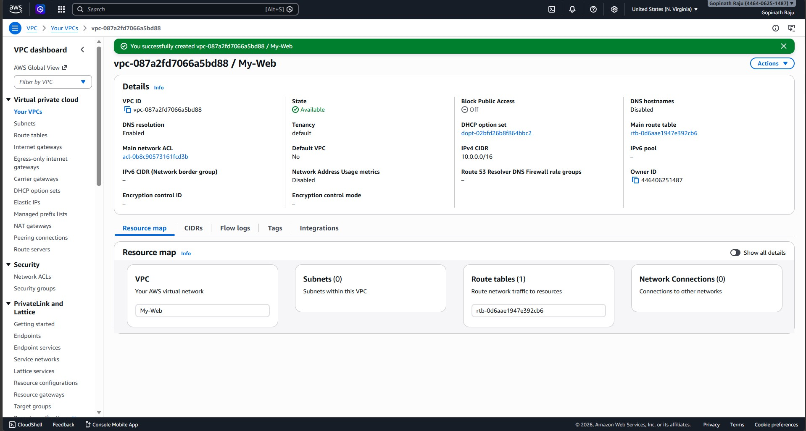

### 2. Internet Gateway — Attached to My-Web VPC
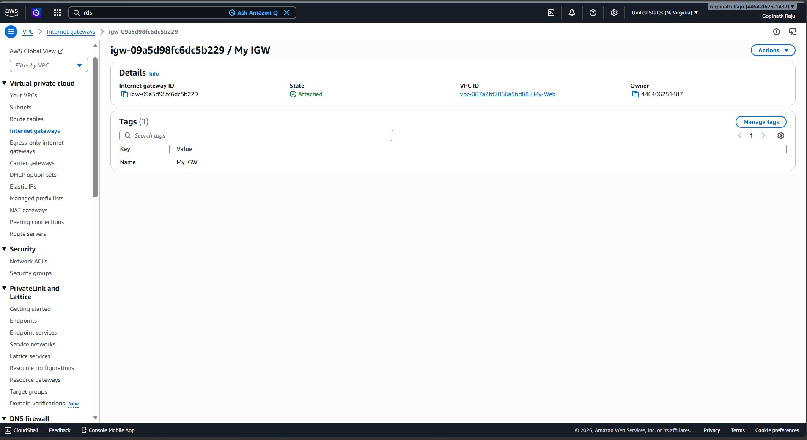

### 3. Subnets — 2 Public + 2 Private across 2 AZs
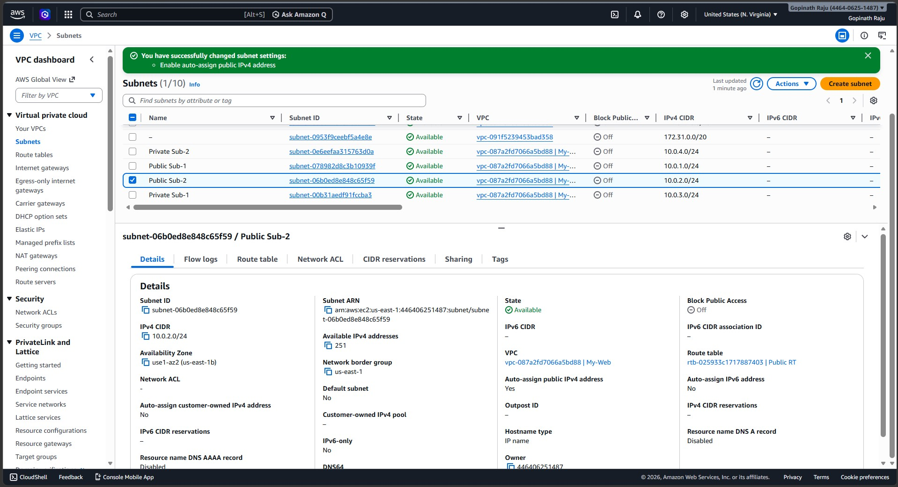

### 4. Route Tables — Public RT with 2 Subnets
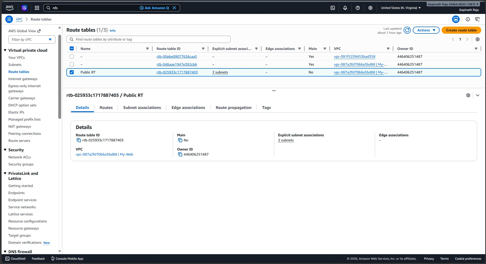

### 5. Security Groups — ALB, EC2, RDS
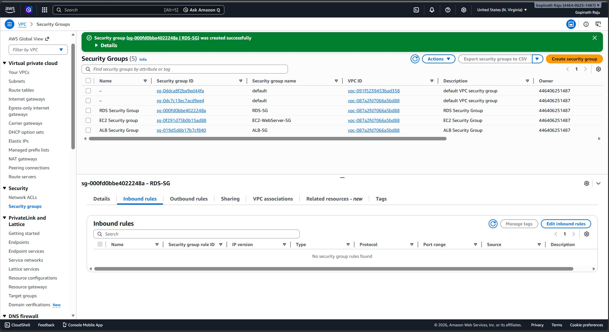

### 6. Launch Template — HA-WebApp-LT (t3.micro)
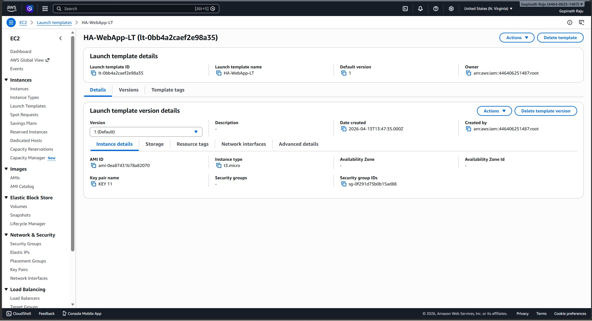

### 7. Auto Scaling Group — Min 2, Max 4, 2 AZs
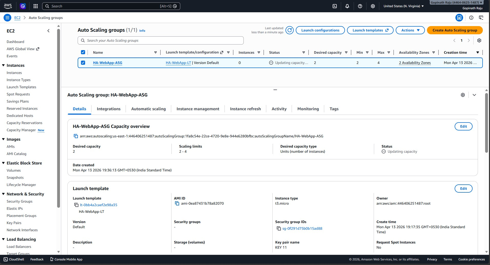

### 8. ASG Instances — 2 Running Instances
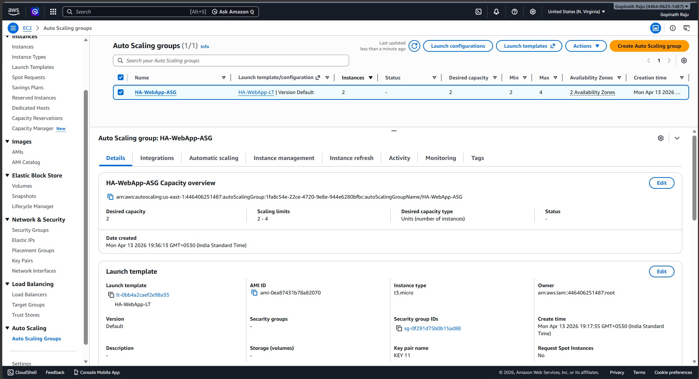

### 9. Load Balancer — HA-WebApp-ALB Created
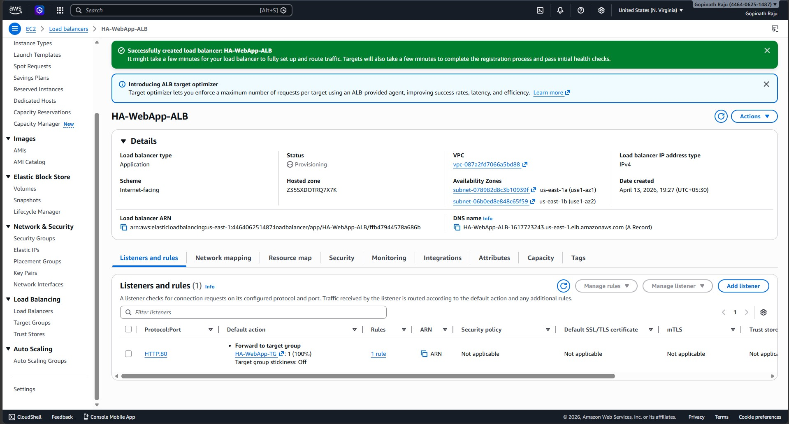

### 10. Target Group — 2 Healthy Instances
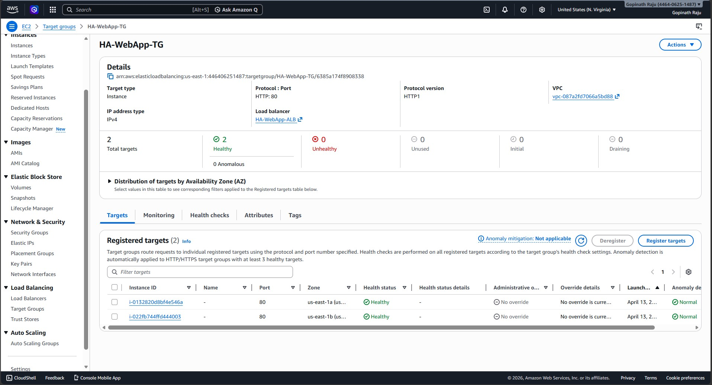

### 11. DB Subnet Group Created
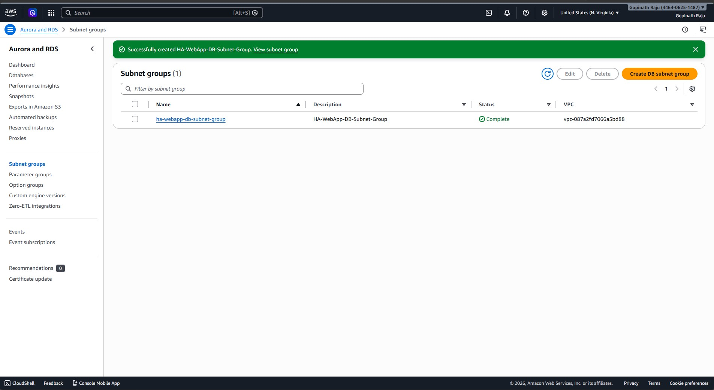

### 12. RDS Database Created
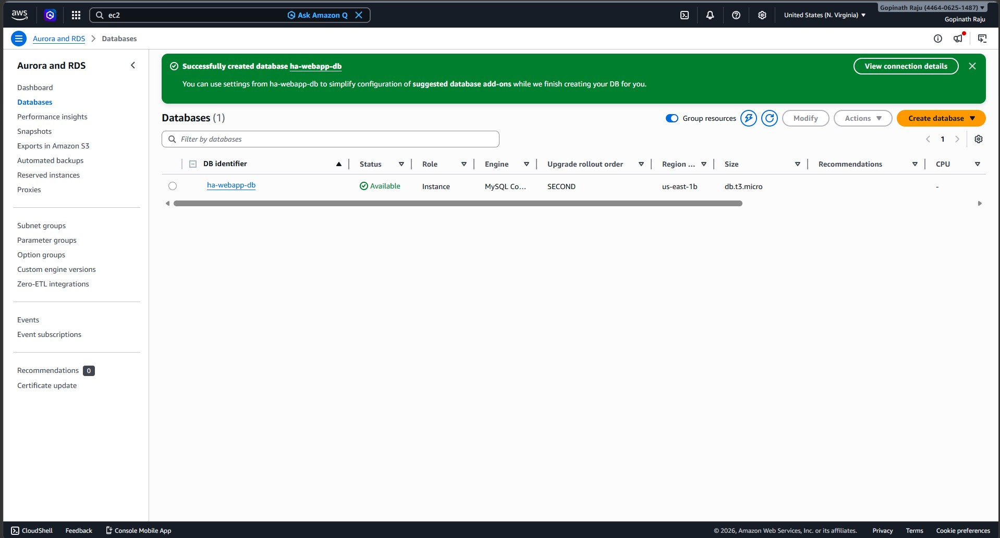

### 13. RDS — Available Status
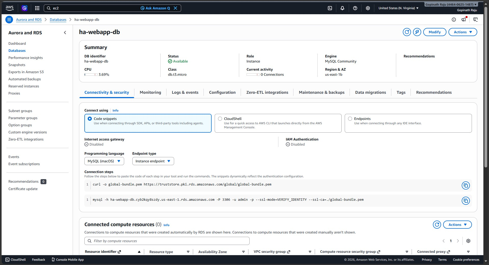

### 14. CloudWatch Alarm — CPU > 70%
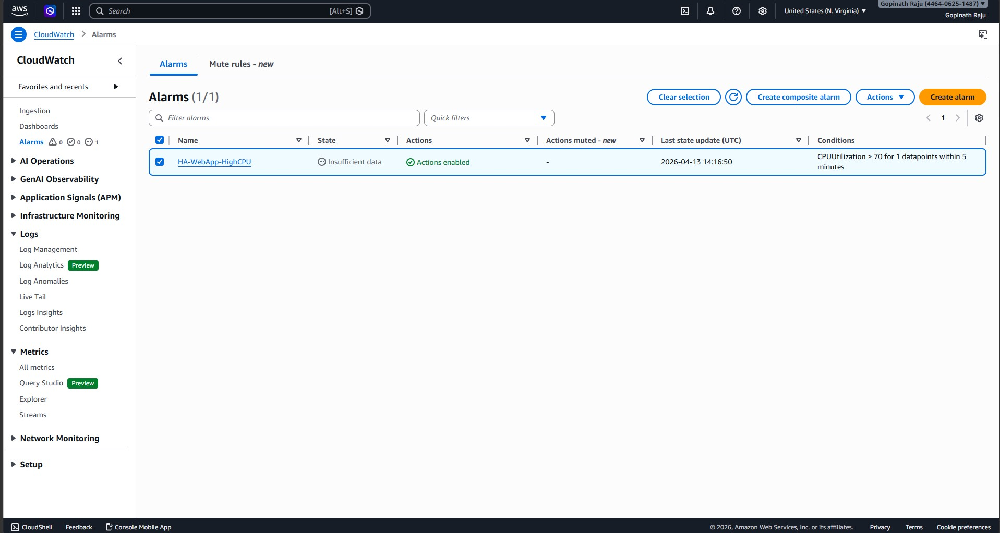

### 15. SNS Topic — Email Confirmed
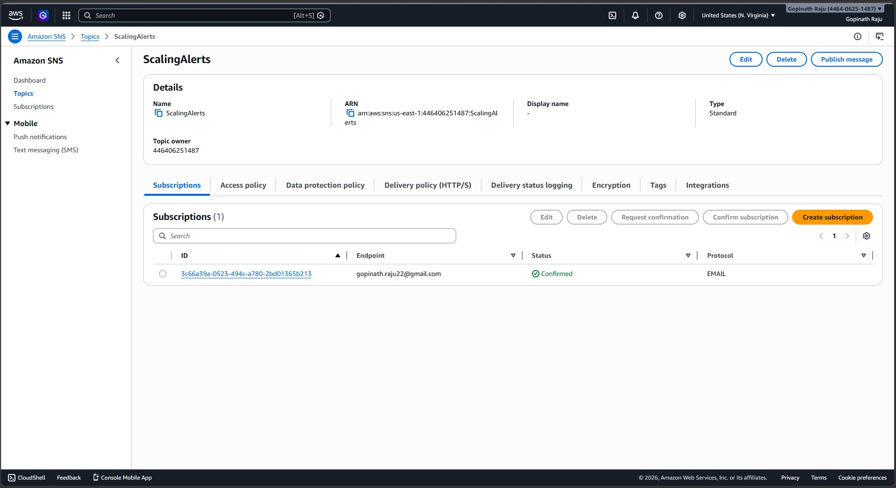

### 16. Live Web App via ALB URL ✅
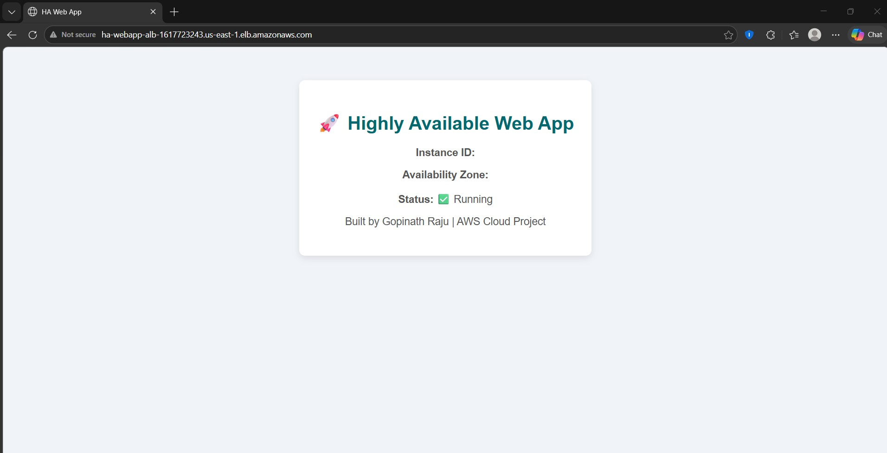

---

## ✅ What This Project Demonstrates

- Custom VPC with public and private subnet separation across 2 Availability Zones
- Auto Scaling Group automatically replaces failed instances and scales based on demand
- Application Load Balancer distributes incoming traffic evenly across both AZs
- RDS MySQL deployed in private subnets — not accessible from the internet
- CloudWatch Alarm + SNS provides real-time CPU monitoring and email notifications
- Layered security groups following the principle of least privilege

---

## 👨‍💻 Author

**Gopinath Raju** — AWS SA - FITA Academy
